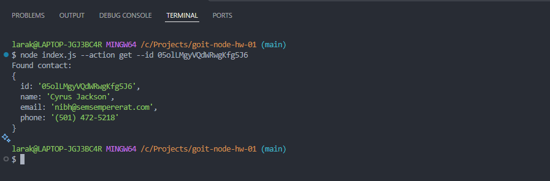
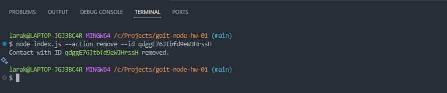

# goit-nodejs-hw-01

## Actions:

### List all contacts

#### node index.js --action list

### Get a contact by ID

#### node index.js --action get --id 05olLMgyVQdWRwgKfg5J6

### Add a new contact

#### node index.js --action add --name Mango --email mango@gmail.com --phone 322-22-22

### Remove a contact

#### node index.js --action remove --id qdggE76Jtbfd9eWJHrssH

